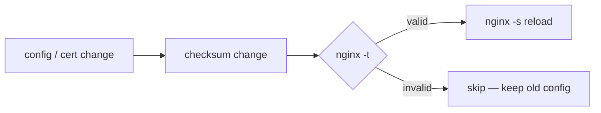
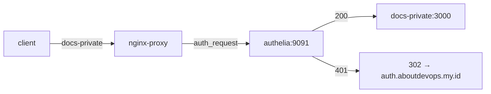

# Nginx Reverse Proxy

Dockerized Nginx reverse proxy with Let's Encrypt (Certbot + Cloudflare DNS-01), DRY config via snippets, safe auto-reload, and Authelia forward-auth for private docs.

## Features

- Multi-domain reverse proxy (`nginx/conf.d/` — one file per domain)
- Automatic TLS via Cloudflare DNS-01 (wildcard-friendly); renew loop every 12h
- Shared snippets for redirect, SSL, security headers, proxy headers, Authelia
- Safe auto-reload: `nginx -t` before reload; invalid config is skipped
- Pritunl VPN TCP passthrough (port 1194)
- GitHub Actions SSL check / renew (`scripts/ssl-check.sh`)

## Layout

```
nginx-reverse-proxy/
├── .github/workflows/ssl-check.yml
├── scripts/ssl-check.sh
├── docker-compose.yml          # nginx + certbot
├── .env.example
└── nginx/
    ├── nginx.conf
    ├── reload-watcher.sh
    ├── snippets/
    │   ├── redirect-https.conf
    │   ├── ssl.conf
    │   ├── security-headers.conf
    │   ├── proxy-params.conf
    │   ├── authelia-authz-location.conf
    │   └── authelia-authreq.conf
    └── conf.d/
        ├── _template.conf.example
        ├── core.conf           # core.aboutdevops.my.id         → backend:8080
        ├── dashboard.conf      # dashboard.aboutdevops.my.id    → frontend:3000
        ├── docusaurus.conf     # docs.aboutdevops.my.id         → docs-site:3000 (public)
        ├── docs-private.conf   # docs-private.aboutdevops.my.id → docs-private:3000 (Authelia)
        ├── auth.conf           # auth.aboutdevops.my.id         → authelia:9091
        └── pritunl.conf        # vpn.aboutdevops.my.id          → pritunl
```

## Prerequisites

- Docker + Compose
- External Docker network `proxy`:
  ```bash
  docker network create proxy
  ```
- Domain on Cloudflare + API token with DNS edit permission
- Host path `/etc/letsencrypt` mounted into containers

## Setup

1. **Env**
   ```bash
   cp .env.example .env
   # set DOMAIN, EMAIL, CLOUDFLARE_API_TOKEN
   ```

2. **Network** (if needed)
   ```bash
   docker network create proxy
   ```

3. **First certificate** (wildcard, once)
   ```bash
   docker compose run --rm --entrypoint sh certbot -c '
     umask 077
     printf "dns_cloudflare_api_token = %s\n" "$CLOUDFLARE_API_TOKEN" > /etc/cloudflare.ini
     certbot certonly --dns-cloudflare \
       --dns-cloudflare-credentials /etc/cloudflare.ini \
       --non-interactive --agree-tos --email "$EMAIL" \
       -d "$DOMAIN" -d "*.$DOMAIN"
   '
   ```
   Later renewals: `certbot` service (12h) + GitHub Actions SSL workflow.

4. **Start**
   ```bash
   docker compose up -d
   docker compose exec nginx nginx -t
   ```

## Add a domain

```bash
cp nginx/conf.d/_template.conf.example nginx/conf.d/<name>.conf
# set <domain> and <upstream>, e.g. http://myservice:8080
```

Upstream container must join network `proxy`. Save the file — `reload-watcher.sh` validates and reloads within ~10s.

`*.aboutdevops.my.id` is covered by the wildcard cert in `nginx/snippets/ssl.conf`. Other domains need their own cert first.

## Auto-reload

`reload-watcher.sh` polls checksums of `nginx.conf`, `conf.d/`, `snippets/`, and `letsencrypt/live` (default interval `10s`, override with `RELOAD_INTERVAL`).



## Private docs (Authelia)

| Host | Upstream | Auth |
|---|---|---|
| `docs.aboutdevops.my.id` | `docs-site:3000` | Public |
| `docs-private.aboutdevops.my.id` | `docs-private:3000` | Authelia |
| `auth.aboutdevops.my.id` | `authelia:9091` | Login portal |



Protect another service:

```nginx
include /etc/nginx/snippets/authelia-authz-location.conf;  # server level

location / {
    include /etc/nginx/snippets/authelia-authreq.conf;     # location level
    proxy_pass http://<upstream>;
    include /etc/nginx/snippets/proxy-params.conf;
}
```

`authelia` (9091) and `docs-private` (3000) must run on network `proxy` (managed separately). Authelia ≥ 4.37 with `/api/authz/auth-request`, session domain `aboutdevops.my.id`.

## Environment (`.env`)

| Variable | Used by | Notes |
|---|---|---|
| `CLOUDFLARE_API_TOKEN` | certbot / ssl-check | Written to `/etc/cloudflare.ini` at runtime |
| `EMAIL` | certbot / ssl-check | Let's Encrypt registration email |
| `DOMAIN` | certbot / ssl-check | Primary domain (e.g. `aboutdevops.my.id`) |

`.env` is gitignored — do not commit it.

## GitHub Actions — SSL Check

[`.github/workflows/ssl-check.yml`](.github/workflows/ssl-check.yml) runs on `ubuntu-latest`, copies [`scripts/ssl-check.sh`](scripts/ssl-check.sh) to the VPS, then SSHs in to issue / check / renew certs.

| Trigger | When |
|---|---|
| `workflow_dispatch` | Manual |
| `schedule` | Mondays 03:00 UTC |
| `push` to `main` | Changes to the workflow, script, or `docker-compose.yml` |

**Behavior:** missing cert → issue wildcard; &lt; 30 days left → renew; else skip.

| Secret | Description |
|---|---|
| `SSH_HOST` | VPS host |
| `SSH_USER` | `ubuntu` (sudo) or `root` |
| `SSH_PRIVATE_KEY` | PEM key |
| `SSH_PORT` | Optional (default `22`) |
| `DEPLOY_PATH` | Absolute repo path, e.g. `/home/ubuntu/infra/nginx-reverse-proxy` |
| `CLOUDFLARE_API_TOKEN` | Cloudflare DNS token |
| `SSL_EMAIL` | Let's Encrypt email |

If `SSH_USER=ubuntu`, configure passwordless sudo (`/etc/letsencrypt` is root-only):

```bash
sudo visudo
# ubuntu ALL=(ALL) NOPASSWD: ALL
sudo true && sudo ls /etc/letsencrypt/live/aboutdevops.my.id/fullchain.pem
```

Manual run on the VPS:

```bash
cd /home/ubuntu/infra/nginx-reverse-proxy
EMAIL=... CLOUDFLARE_API_TOKEN=... ./scripts/ssl-check.sh
```

## Useful commands

```bash
docker compose up -d
docker compose logs -f nginx
docker compose logs -f certbot
docker compose exec nginx nginx -t
docker compose exec certbot certbot certificates
```

## Troubleshooting

- **`host not found in upstream`** — target container missing or not on network `proxy`.
- **`Unable to find post-hook command nginx`** — stale hook in renewal config:
  ```bash
  sed -i '/^post_hook/d' /etc/letsencrypt/renewal/*.conf
  docker compose up -d --force-recreate certbot
  ```
  Reload is handled by `reload-watcher.sh`; post-hook is not needed.
- **Cert renewed but nginx still uses old cert** — check `docker compose logs nginx` for `[reload-watcher]`.
- **CI: `no configuration file provided`** — fix `DEPLOY_PATH` (must contain `docker-compose.yml`).
