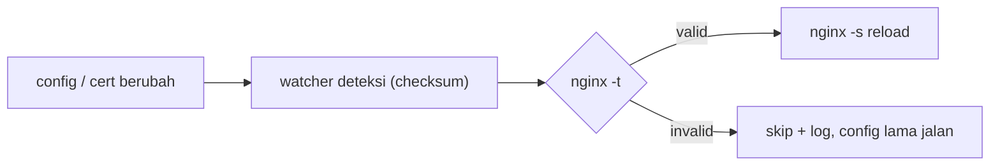

# Nginx Reverse Proxy

Reverse proxy berbasis Nginx (Docker) dengan TLS otomatis via Let's Encrypt (Certbot + Cloudflare DNS challenge), konfigurasi per-domain yang DRY lewat _snippets_, dan auto-reload yang aman (validasi dulu sebelum reload).

## Fitur

- **Reverse proxy multi-domain** — tiap domain punya file config sendiri di `nginx/conf.d/`.
- **TLS otomatis** — Certbot pakai Cloudflare DNS-01 challenge, cocok untuk wildcard cert dan domain di belakang Cloudflare. Auto-renew tiap 12 jam.
- **Config DRY** — blok berulang (redirect, SSL, security headers, proxy params) diekstrak ke `nginx/snippets/` dan tinggal di-`include`.
- **Auto-reload aman** — `nginx/reload-watcher.sh` memantau perubahan config/cert, jalankan `nginx -t` dulu; kalau valid baru reload, kalau invalid di-skip (proxy lama tetap jalan).
- **VPN passthrough** — TCP stream untuk Pritunl VPN (port 1194).

## Struktur

```
nginx-reverse-proxy/
├── docker-compose.yml          # service: nginx + certbot
├── .env                        # secret (gitignored) - dibuat dari .env.example
├── .env.example                # template env
└── nginx/
    ├── nginx.conf              # config utama (http + stream)
    ├── reload-watcher.sh       # auto-reload + validasi
    ├── snippets/               # blok config reusable
    │   ├── redirect-https.conf # redirect HTTP -> HTTPS
    │   ├── ssl.conf            # path cert wildcard
    │   ├── security-headers.conf
    │   └── proxy-params.conf   # proxy_set_header standar
    └── conf.d/                 # 1 file per domain
        ├── _template.conf.example  # pola acuan (tidak di-load)
        ├── core.conf           # core.aboutdevops.my.id      -> backend:8080
        ├── dashboard.conf      # dashboard.aboutdevops.my.id -> frontend:3000
        ├── docusaurus.conf     # docs.aboutdevops.my.id      -> docusaurus:3000
        └── pritunl.conf        # vpn.aboutdevops.my.id       -> pritunl (web + VPN)
```

## Prasyarat

- Docker + Docker Compose.
- Docker network eksternal bernama `proxy` (dipakai bareng service backend lain):
  ```bash
  docker network create proxy
  ```
- Domain kamu dikelola di Cloudflare, dan sudah punya API token dengan izin edit DNS zone.
- Cert Let's Encrypt tersimpan di host `/etc/letsencrypt` (mount ke container).

## Setup

1. **Siapkan env**
   ```bash
   cp .env.example .env
   # isi CLOUDFLARE_API_TOKEN, EMAIL, DOMAIN
   ```

2. **Buat network (kalau belum ada)**
   ```bash
   docker network create proxy
   ```

3. **Terbitkan cert pertama kali** (contoh wildcard, sekali jalan):
   ```bash
   docker compose run --rm certbot certbot certonly \
     --dns-cloudflare \
     --dns-cloudflare-credentials /etc/cloudflare.ini \
     -d 'aboutdevops.my.id' -d '*.aboutdevops.my.id' \
     --email "$EMAIL" --agree-tos --no-eff-email
   ```
   > Renewal berikutnya otomatis lewat service `certbot`.

4. **Jalankan**
   ```bash
   docker compose up -d
   docker compose exec nginx nginx -t
   ```

## Menambah domain baru

1. Copy template jadi file config baru:
   ```bash
   cp nginx/conf.d/_template.conf.example nginx/conf.d/<nama>.conf
   ```
2. Ganti `<domain>` dan `<upstream>` (contoh `http://myservice:8080`).
3. Pastikan container target berada di network `proxy` supaya nama service bisa di-resolve Nginx.
4. Simpan — `reload-watcher.sh` otomatis validasi + reload (maks ~10 detik). Tidak perlu reload manual.

Pola minimal (lihat `nginx/conf.d/_template.conf.example`):

```nginx
server {
    listen 80;
    listen [::]:80;
    server_name <domain>;
    include /etc/nginx/snippets/redirect-https.conf;
}
server {
    listen 443 ssl;
    listen [::]:443 ssl;
    http2 on;
    server_name <domain>;

    include /etc/nginx/snippets/ssl.conf;
    include /etc/nginx/snippets/security-headers.conf;

    location / {
        proxy_pass <upstream>;
        include /etc/nginx/snippets/proxy-params.conf;
    }
}
```

> Cert: subdomain `*.aboutdevops.my.id` sudah tercakup wildcard di `nginx/snippets/ssl.conf`. Domain lain perlu diterbitkan cert-nya dulu.

## Cara kerja auto-reload

`reload-watcher.sh` memantau `nginx.conf`, `conf.d/`, `snippets/`, dan `letsencrypt/live` via checksum (polling, interval `RELOAD_INTERVAL`, default `10`s).



Ubah interval lewat env di service `nginx`, misal `RELOAD_INTERVAL=5`.

## Variabel environment (`.env`)

| Variabel | Dipakai oleh | Keterangan |
|---|---|---|
| `CLOUDFLARE_API_TOKEN` | certbot | Token Cloudflare untuk DNS challenge. Digenerate jadi `/etc/cloudflare.ini` saat start. |
| `EMAIL` | certbot | Email registrasi Let's Encrypt (untuk penerbitan cert manual). |
| `DOMAIN` | referensi | Domain utama. |

> `.env` berisi secret dan sudah masuk `.gitignore`. Jangan commit.

## Perintah berguna

```bash
docker compose up -d                    # start
docker compose logs -f nginx            # lihat log watcher/reload
docker compose logs -f certbot          # lihat log renewal
docker compose exec nginx nginx -t      # tes config
docker compose exec certbot certbot certificates   # cek cert
docker compose restart nginx            # restart manual (jarang perlu)
```

## Troubleshooting

- **`nginx: host not found in upstream "..."`** — container target belum ada / belum join network `proxy`. Pastikan service target `networks: [proxy]`.
- **Certbot: `Unable to find post-hook command nginx`** — hook lama tersimpan di renewal config. Bersihkan:
  ```bash
  sed -i '/^post_hook/d' /etc/letsencrypt/renewal/*.conf
  docker compose up -d --force-recreate certbot
  ```
  Reload nginx sudah ditangani `reload-watcher.sh`, jadi post-hook tidak diperlukan.
- **Cert tidak ke-reload setelah renew** — watcher memantau `letsencrypt/live`; cek `docker compose logs nginx` untuk baris `[reload-watcher]`.
